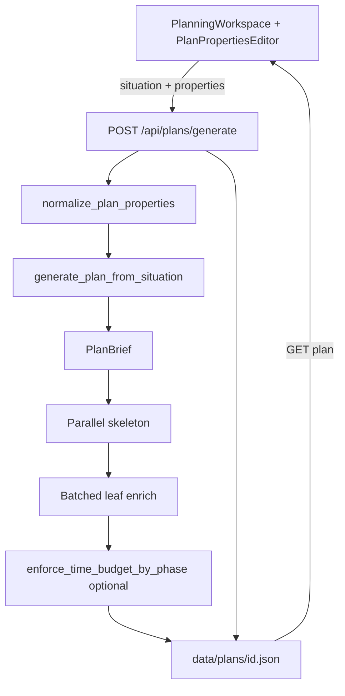

# Planning context (custom properties)

This document describes the **optional planning context** feature: named fields users add below the situation, how they are sent to the LLM, how plans are generated with them, and how time budgets are enforced in code.

---

## 1. Purpose

Users describe a **situation** in a textarea. Optionally they enable **Planning context** and add one or more **properties** (field name + value), for example:

| Field name | Value / description |
|------------|---------------------|
| Complete within | 10 hours |
| Time available per week | 5 hours |
| Main focus | Ship one video, not a series |

Goals:

- Give the model **constraints** (time, scope, success criteria) without overloading the situation text.
- **Persist** filled properties on saved plans so reload from the sidebar restores the editor.
- **Enforce** total time budgets in code when a deadline-like field is parseable (e.g. `10 hours`).

If the toggle is off or no row has both name and value filled, behavior matches **situation-only** generation (`properties: []`).

---

## 2. Data model

### Shared shape (API + frontend)

```json
{
  "name": "Complete within",
  "value": "10 hours",
  "templateId": "deadline"
}
```

| Field | Rules |
|-------|--------|
| `name` | 1–80 chars, trimmed |
| `value` | 1–800 chars, trimmed |
| `templateId` | Optional; preset id (`deadline`, `hours_per_week`, etc.) or omitted for custom names like `Total time` |

**Server:** `PlanProperty` in `backend/app/models/plan.py`  
**Client:** `PlanProperty` in `frontend/src/lib/plan-types.ts`

### Preset templates (suggestions only)

Defined in:

- `frontend/src/lib/plan-property-templates.ts`
- `backend/app/constants_properties.py` (mirror + allowlist)

| `templateId` | Suggested field name |
|--------------|----------------------|
| `deadline` | Complete within |
| `hours_per_week` | Time available per week |
| `success` | Success looks like |
| `constraints` | Constraints |
| `current_state` | Current state / starting point |
| `focus` | Main focus |

Users type any field name; matching a preset label sets `templateId` for validation and deadline detection.

### Limits

- Max **12** properties per request (client + server).
- **Duplicate names** (case-insensitive) → HTTP 400 from API.
- Empty name or value rows are **not** sent or stored.

### Persistence

`SavedPlan` includes `properties: PlanProperty[]` (default `[]`). Stored in `data/plans/{id}.json`. Old plans without `properties` load as `[]`.

---

## 3. Frontend flow

### UI

**Canvas workspace** (`PlanningWorkspace.tsx` + `InspectorPanel.tsx`): situation node and per-step **+** affordances open the inspector. After **Save situation**, users choose **Plan detail** (`low` | `medium` | `high`) before generating; this drives phase count, tree depth, and minimum leaf targets via `backend/app/plan_detail.py` (no hard maximum leaf count). Root context uses `PlanPropertiesEditor`; step context uses the same editor (`alwaysOn`) and **Save & regenerate subtree**.

**Legacy form** (`PlanPropertiesEditor.tsx`):

Schema-builder style card:

- Header: **Planning context** + toggle on the right.
- When on: table-like rows — **Field name** | **Value / description** | remove (×).
- **+ Add property** adds a row; datalist suggests preset names.
- Green footer when at least one row is fully filled: “Ready with N properties…”

### State (`HomePage.tsx`)

- `propertiesEnabled`, `propertyRows`, `savedProperties`
- On toggle on with no rows → one empty row is added.
- Generate blocked if toggle on but `buildPropertiesPayload()` is empty.

### Payload (`plan-properties.ts`)

`buildPropertiesPayload(enabled, rows)`:

- Toggle off → `[]`
- Else → only rows with trimmed `name` and `value`, dedupe by name, max 12

### API call

```http
POST /api/plans/generate
Content-Type: application/json

{
  "situation": "...",
  "detailLevel": "medium",
  "properties": [
    { "name": "Complete within", "value": "10 hours", "templateId": "deadline" }
  ]
}
```

Optional: `locale` (unchanged).

### After generate

- Response includes `properties` (normalized list from server).
- Banner: “Planning context applied: …”
- Export (JSON/Markdown) can include a **Planning context** section.

### Reload

`GET /api/plans/{id}` → `rowsFromSavedProperties(record.properties)` restores editor and enables toggle if any properties exist.

---

## 4. Backend API flow

`backend/app/routers/plans.py` → `generate_plan()`:

1. Validate situation length.
2. `normalize_plan_properties(body.properties)` (`backend/app/plan_properties.py`).
3. `generate_plan_from_situation(situation, locale, properties=properties)`.
4. `save_plan(SavedPlan(..., properties=properties))`.
5. Return `{ id, steps, properties }`.

`GenerateBody`:

```python
situation: str
locale: str | None = None
properties: list[PlanProperty] = []
```

---

## 5. How properties reach the LLM

Properties are **not** concatenated into the situation string. They become a **text block** used on every generation call.

### Build context (`planning.py`)

1. `format_properties_block(properties)` → multi-line string, for example:

   ```
   === PLANNING CONTEXT (mandatory — apply before the situation) ===
   • Complete within: 10 hours
   TOTAL TIME BUDGET: 600 minutes for all leaf tasks combined...
   ```

2. `context_tail` = optional `locale` line + properties block (plan vs branch budget lines when applicable).

3. **Plan-wide** cap: `plan_budget_minutes_from_properties(root properties)` — scales all leaves after full generate.

4. **Branch** cap: `branch_budget_minutes_from_properties(step properties)` on subtree regen — scales only that step’s new children (e.g. “Complete within” or “Time for subtasks” on the step).

### Per OpenAI call (11 total)

Each call has:

**System message** (`_system_content`):

- Role intro + `SHARED_FIELDS` + `PLANNING_RULES`
- If any properties: extra `PROPERTIES_SYSTEM_RULES`
- Phase rules (`PHASE1_RULES` / `PHASE2_RULES` / `PHASE3_RULES`)
- JSON shape hint

**User message** (`_user_plan_content`):

1. `context_tail` (planning context **first**)
2. `Situation:\n{situation}`
3. Phase-specific instructions (parent title, substeps list, etc.)

The model always sees constraints before the situation.

### Structured output

`_call_structured()` uses OpenAI `chat.completions.parse` with Pydantic models (`TopLevelOnly`, `SubstepsForParent`, `ExecutionBatch`), with retries.

---

## 6. Plan generation pipeline (free-form tree)

1. **PlanBrief** (1 call) — phases with `allocatedMinutes`, `maxDepth`, `suggestedTotalLeaves`; minutes normalized to deadline cap when set.
2. **Parallel skeleton** — breadth-first expansion with parent minute budgets; leaves are `isActionable: true` with no children.
3. **Leaf enrichment** — batched calls add `implementationGuide`, `acceptanceCriteria`, refined `estimatedMinutes`.
4. **Validation** — `validate_plan_tree()`; rollup; optional `enforce_time_budget_by_phase()` (scales within each top-level phase).

**Step context (+):** `POST /api/plans/{id}/apply-step-context` revises **that step only** (title, description, and for leaves: minutes + how-to). Existing children are never replaced or added.

**Suggest fields:** `POST /api/plans/suggest-properties` after saving situation (or for step scope).

### Time budget enforcement (`plan_budget.py`)

**Detection:** `templateId == "deadline"` or name contains `complete within`, `deadline`, `time budget`, `total time`.

**Parsing:** regex on value — hours, days (8h/day), weeks (40h/week), minutes.

**Enforcement:** `enforce_time_budget_by_phase` scales leaves **per top-level phase** to preserve phase proportions; `enforce_time_budget` remains a global fallback. Parents recomputed via rollup.

Non-time properties (focus, constraints, success) affect the plan **only via prompts**, not post-processing.

---

## 7. End-to-end diagram



---

## 8. Files reference

| Area | Files |
|------|--------|
| Models | `backend/app/models/plan.py` |
| Validation | `backend/app/plan_properties.py`, `backend/app/constants_properties.py` |
| Budget | `backend/app/plan_budget.py` |
| Generation | `backend/app/services/planning.py` |
| API | `backend/app/routers/plans.py` |
| UI | `frontend/src/components/PlanPropertiesEditor.tsx`, `HomePage.tsx` |
| Lib | `frontend/src/lib/plan-properties.ts`, `plan-property-templates.ts`, `plan-types.ts` |
| Export | `frontend/src/lib/export-plan.ts` |
| Detail scale | `backend/app/plan_detail.py`, `PlanDetailSelector.tsx` |
| Tests | `backend/tests/test_plan_properties.py`, `test_plan_budget.py`, `test_plan_brief.py`, `test_plan_validation.py`, `test_plan_detail.py` |

---

## 9. Verification checklist

1. Toggle off → same as before; no context in prompts; `properties: []` in save file.
2. Toggle on, fill **Complete within: 4 weeks** → generate → saved JSON has `properties` array.
3. Reload plan → fields and toggle restored.
4. Custom **Budget: $200** → appears in context block and saved file.
5. Empty rows not sent.
6. More than 12 properties or duplicate names → 400.
7. **Complete within: 10 hours** → leaf totals after generate ≤ ~600 minutes (post-scale).

---

## 10. Limitations and future ideas

- **125 tasks** with a very small total budget (e.g. 10 hours) forces aggressive scaling; scope/narrative may still feel large while minutes are capped.
- **Budget math** (hours/week × deadline) is not computed automatically.
- No **PlanBrief** pre-pass or regenerate-if-over-budget beyond leaf scaling.
- LLM may still under-scope titles/descriptions even when minutes are scaled; prompts + `enforce_time_budget` are the main levers today.

---

## 11. Running locally

- Backend: `cd backend && python -m uvicorn app.main:app --reload --port 8000`
- Frontend: `cd frontend && npm run dev` (proxies `/api` → 8000)
- Requires `OPENAI_API_KEY` in `.env` or `.env.local`
