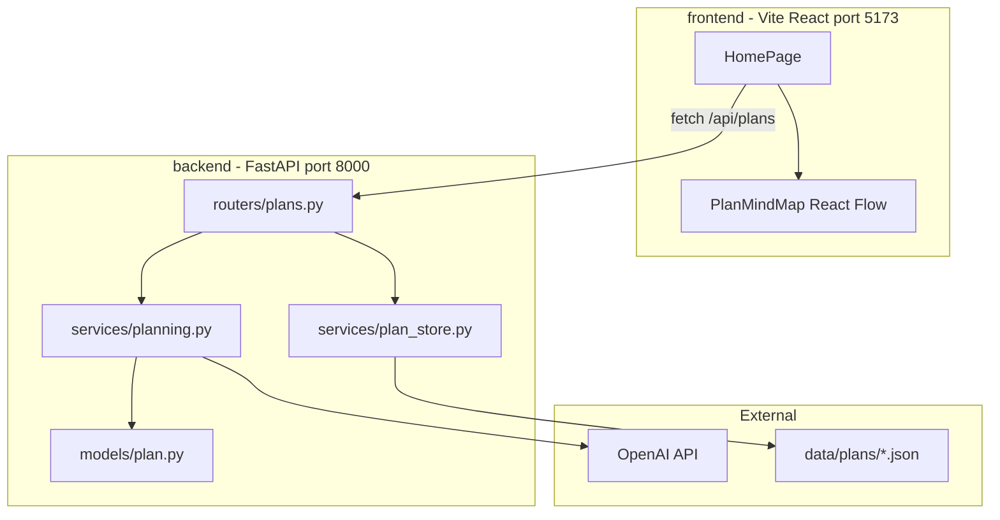
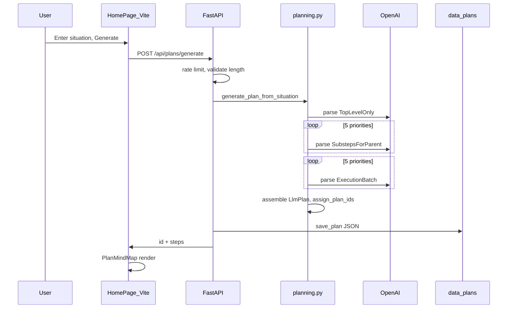

# Next Steps Agent — Initial Plan & Execution Summary

This document describes the system: a **FastAPI + Pydantic** backend and a **Vite + React** frontend that turn free-text situations into **free-form plan trees** with actionable leaf steps. The primary UI is the **planning canvas** at `/plan`.

---

## 1. Product goal

**Next Steps Agent** accepts a user **situation** and produces a **free-form plan tree** (typically 2–4 levels). Top-level **phases** branch into milestones; **leaves** are actionable tasks with `implementationGuide` and `acceptanceCriteria`. Each step has `title`, `description`, `priority` (`low` \| `medium` \| `high` \| `critical`), and `estimatedMinutes`.

The primary UI is the **planning canvas** at `/plan` (`PlanningWorkspace`): situation node, mind-map tree, and a right inspector (**+** on a step = branch context / regenerate; click a leaf = how-to implement).

---

## 2. Tech stack (post-migration)

| Layer | Path | Technology |
|-------|------|------------|
| API | `backend/app/` | FastAPI, **Pydantic v2**, OpenAI Python SDK |
| UI | `frontend/src/` | Vite 6, React 19, Tailwind 4, `@xyflow/react` |
| Validation | `backend/app/models/plan.py` | Pydantic models (replaces former Zod schemas) |
| Storage | `data/plans/` | JSON files per plan (gitignored) |

**Previous stack (removed):** Next.js App Router, TypeScript `lib/plan-schema.ts` (Zod), API routes under `app/api/`.

Environment (repo root `.env` or `.env.local`, loaded by `backend/app/config.py`):

- `OPENAI_API_KEY` — required
- `OPENAI_MODEL` or `OPENAI_MODEL_ID` — optional (default `gpt-4o-mini`)
- `OPENAI_ORGANIZATION` or `OPENAI_ORG_ID` — optional
- `PLANS_DIR` — optional override for plan storage

---

## 3. High-level architecture



**Development:** UI and API run on different ports; Vite proxies `/api` → `http://127.0.0.1:8000`.

**Production:** `frontend/dist` is built and served by FastAPI from `backend/app/main.py` on a single host (e.g. port 8000).

---

## 4. Repository layout

```
NextStepsAgent/
  backend/
    requirements.txt
    app/
      main.py                 # FastAPI app, CORS, SPA static mount
      config.py               # env, limits, PLANS_DIR, FRONTEND_DIST
      models/plan.py          # Pydantic schemas + assign_plan_ids
      routers/plans.py        # REST handlers
      services/
        planning.py           # Staged OpenAI + Pydantic parse
        plan_store.py         # Filesystem CRUD
        export_plan.py        # JSON/Markdown (server-side; UI also exports client-side)
        rate_limit.py         # In-memory sliding window
  frontend/
    vite.config.ts            # @ alias, /api proxy
    src/
      main.tsx, App.tsx
      components/HomePage.tsx
      components/plan-mindmap/
      components/plan-tree/   # ExpandMode, badges; tree optional, mind map primary
      lib/plan-types.ts       # Client TS types (mirror API JSON)
      lib/constants.ts
      lib/export-plan.ts
  data/plans/                 # {uuid}.json (gitignored)
  context/
    initial_plan_description.md
```

---

## 5. Data model (Pydantic)

Fixed fan-out constant:

```8:9:backend/app/models/plan.py
STEPS_PER_BRANCH = 5
Priority = Literal["low", "medium", "high", "critical"]
```

### 5.1 Step fields and full tree

```12:38:backend/app/models/plan.py
class StepFields(BaseModel):
    model_config = ConfigDict(str_strip_whitespace=True, populate_by_name=True)

    title: str = Field(min_length=1, max_length=200)
    description: str = Field(min_length=1, max_length=4000)
    priority: Priority
    estimated_minutes: int = Field(
        alias="estimatedMinutes",
        gt=0,
        le=10_080,
    )
// ...
class LlmPlan(BaseModel):
    steps: list[Level1Step] = Field(min_length=STEPS_PER_BRANCH, max_length=STEPS_PER_BRANCH)
```

**JSON uses camelCase** (`estimatedMinutes`, `createdAt`, `situationPreview`) via Pydantic aliases; responses use `model_dump(by_alias=True)`.

### 5.2 Staged-generation models (partial LLM responses)

| Model | Phase | Shape |
|-------|-------|--------|
| `TopLevelOnly` | 1 | `{ steps: [5 × StepFields] }` |
| `SubstepsForParent` | 2 | `{ children: [5 × StepFields] }` |
| `ExecutionBatch` | 3 | `{ substeps: [5 × { children: [5 × StepFields] }] }` |

### 5.3 Runtime plan with IDs

After validation, `assign_plan_ids()` attaches `uuid4()` strings at every node → `list[PlanStep]`.

### 5.4 Persistence

```76:82:backend/app/models/plan.py
class SavedPlan(BaseModel):
    model_config = ConfigDict(populate_by_name=True)

    id: str
    situation: str
    created_at: str = Field(alias="createdAt")
    steps: list[PlanStep]
    properties: list[PlanProperty] = Field(default_factory=list)
```

### 5.5 Optional planning properties

Users can enable **Planning context** under the situation field (`PlanPropertiesEditor`). Field name + value rows (presets or custom) are sent only when filled.

- **API:** `POST /api/plans/generate` body may include `properties: PlanProperty[]` (max 12, unique names case-insensitive). Empty/disabled → `[]` — same prompts as situation-only.
- **LLM:** `format_properties_block()` in `planning.py` injects a planning context block **before** the situation on all 11 calls; optional `enforce_time_budget()` after generation.
- **Persistence:** Saved in `data/plans/{id}.json`; reload restores the editor. Old plans without `properties` deserialize as `[]`.

**Full documentation:** [custom_property.md](./custom_property.md)

Files: `data/plans/{id}.json`. `plan_store.py` uses `path.basename` on IDs to block path traversal.

---

## 6. Plan generation pipeline

### 6.1 Why staged generation?

One LLM call for 125 detailed leaves is unreliable. The server runs **11 OpenAI requests**:

| Phase | Calls | Pydantic `response_format` |
|-------|-------|----------------------------|
| Top priorities | 1 | `TopLevelOnly` |
| Substeps per priority | 5 (parallel) | `SubstepsForParent` |
| Execution per priority | 5 (parallel) | `ExecutionBatch` |

Then Python **assembles** `LlmPlan`, validates, and calls `assign_plan_ids()`.

### 6.2 Entry point

`POST /api/plans/generate` in `backend/app/routers/plans.py` → `generate_plan_from_situation()` in `backend/app/services/planning.py`.

### 6.3 Structured output and retries

`_call_structured()` uses `client.chat.completions.parse(..., response_format=<Pydantic model>)`. On failure it falls back to `json_object` mode and `model_validate`, up to **3 attempts** with a corrective user message.

```75:83:backend/app/services/planning.py
                completion = client.chat.completions.parse(
                    model=model,
                    temperature=0.2 if attempt == 0 else 0.08,
                    messages=msgs,
                    response_format=response_model,
                )
                parsed = completion.choices[0].message.parsed
                if parsed is not None:
                    return parsed
```

Parallel work uses `ThreadPoolExecutor` (`_map_pool`, max 5 workers).

### 6.4 Where prompts live

Prompts are **inline constants** in `planning.py`, assembled by `_system_content()` for every phase:

- **`SHARED_FIELDS`** — JSON field definitions for each step object
- **`PLANNING_RULES`** — global quality rules (situation-specific, realistic priorities, clear language)
- **`PHASE1_RULES`** — mutually exclusive outcome-oriented priorities in sensible order; no repeated themes
- **`PHASE2_RULES`** — substeps scoped to parent only; each description ends with `Done when: ...`
- **`PHASE3_RULES`** — one-sitting tasks (≤ `MAX_EXECUTION_TASK_MINUTES`, default 90), verb-first titles, no duplicates across substeps
- **User messages** — situation, optional `locale` and **planning properties** block, parent context; phases 2–3 add short reinforcement lines

System messages are built as: `role_intro` + `SHARED_FIELDS` + `PLANNING_RULES` + phase rules + JSON shape hint.

### 6.5 Limits and timeouts

From `backend/app/config.py`:

| Constant | Value |
|----------|--------|
| `MIN_SITUATION_LENGTH` | 10 (trimmed) |
| `MAX_SITUATION_LENGTH` | 8000 |
| `GENERATE_RATE_LIMIT_MAX` | 12 per window |
| `GENERATE_RATE_LIMIT_WINDOW_MS` | 60_000 |
| `OPENAI_TIMEOUT_SEC` | 120 per request |
| `MAX_EXECUTION_TASK_MINUTES` | 90 (leaf tasks; prompt guidance) |

Client abort: `GENERATE_CLIENT_TIMEOUT_MS` = 180_000 in `frontend/src/lib/constants.ts`.

**Production note:** configure uvicorn/reverse-proxy timeout **≥ 300s** for long generate requests.

---

## 7. REST API

| Method | Path | Handler | Notes |
|--------|------|---------|--------|
| `GET` | `/health` | `main.py` | Liveness |
| `GET` | `/api/plans` | `list_plans()` | `{ plans: PlanListItem[] }` |
| `GET` | `/api/plans/{id}` | `get_plan_by_id()` | Full `SavedPlan` or 404 |
| `DELETE` | `/api/plans/{id}` | `delete_plan_by_id()` | `{ ok: true }` or 404 |
| `POST` | `/api/plans/generate` | `generate_plan()` | Body: `{ situation, properties?, locale? }` → `{ id, steps }` |

Generate validation and errors:

- **400** — situation too short/long; duplicate property names; more than 12 properties
- **429** — rate limit (`rate_limit.py`)
- **502** — OpenAI / assembly failure
- **503** — missing `OPENAI_API_KEY`

After success, plan is saved via `save_plan()` and returned to the client.

---

## 8. Frontend (Vite + React)

### 8.1 Bootstrap

```1:8:frontend/src/main.tsx
import { StrictMode } from "react";
import { createRoot } from "react-dom/client";
import App from "./App";
import "./index.css";

createRoot(document.getElementById("root")!).render(
  <StrictMode>
    <App />
```

`App.tsx` renders `HomePage` only (no Next.js SSR).

### 8.2 API access

All fetches use relative URLs (`/api/plans`, etc.). Dev proxy:

```15:19:frontend/vite.config.ts
    proxy: {
      "/api": {
        target: "http://127.0.0.1:8000",
        changeOrigin: true,
      },
```

### 8.3 HomePage behavior

- **State:** `situation`, `propertiesEnabled`, `propertyRows`, `savedProperties`, `steps`, `activeId`, `history`, `expandMode`, `treeKey`, `loading`, `error`
- **On mount:** `useEffect` → `GET /api/plans` for sidebar history (replaces former Next.js SSR `listPlansMeta()`)
- **Generate:** `POST /api/plans/generate` with `AbortController` (3 min timeout)
- **Load plan:** `GET /api/plans/{id}` fills textarea + steps
- **Delete:** `DELETE /api/plans/{id}` with confirm dialog
- **Export:** client-side `exportPlanJson` / `exportPlanMarkdown` in `frontend/src/lib/export-plan.ts`

### 8.4 Plan mind map (primary visualization)

`PlanMindMap` (`@xyflow/react`):

- Root node = situation (violet); depths 1–3 = gray / emerald / sky
- Default expansion: only root open → **5 priority nodes** visible; click to expand/collapse
- Toolbar: Expand all / Collapse all / Reset view → updates `expandMode` + `treeKey`
- Fullscreen, wheel zoom, selected-node description panel

Layout: `frontend/src/components/plan-mindmap/mindmap-layout.ts` (`expandedIdsForMode`, `buildMindMapGraph`).

### 8.5 Plan tree (secondary)

`PlanTree` + Radix collapsible still exist under `frontend/src/components/plan-tree/` and define `ExpandMode`. The home page uses the **mind map**, not the tree list.

### 8.6 Client types

`frontend/src/lib/plan-types.ts` mirrors API JSON (`PlanStep`, `ListItem`, `Priority`) without importing Pydantic.

---

## 9. Running the app

### Development (two terminals)

```bash
# Terminal 1 — API
cd backend
pip install -r requirements.txt
python -m uvicorn app.main:app --reload --port 8000
```

```bash
# Terminal 2 — UI
cd frontend
npm install
npm run dev
```

Open **http://localhost:5173**. If port 8000 is in use (`WinError 10013` / bind error), stop the old process (`netstat -ano | findstr :8000`) or use another port and update `frontend/vite.config.ts` proxy target.

### Production (single server)

```bash
cd frontend && npm run build
cd ../backend && pip install -r requirements.txt
python -m uvicorn app.main:app --host 0.0.0.0 --port 8000
```

Open **http://localhost:8000**. Static SPA + API on same origin.

```41:45:backend/app/main.py
    @app.get("/")
    def spa_root():
        if index_html.is_file():
            return FileResponse(index_html)
        return {"error": "Frontend not built. Run: cd frontend && npm run build"}
```

---

## 10. End-to-end execution flow



---

## 11. Security and operations

- **API keys** only in backend env (never in frontend bundle).
- **Rate limit:** in-memory per client IP (`x-forwarded-for` / `x-real-ip`); resets on server restart.
- **Storage:** local filesystem only; no auth/multi-user.
- **`data/plans/`** may contain personal situations — keep gitignored.

---

## 12. Migration history

| Era | Stack |
|-----|--------|
| Initial | Next.js + Zod + `lib/planning-service.ts` + collapsible tree UI |
| +5×5×5 | Staged generation, delete plans, longer timeouts |
| +Mind map | React Flow on Next.js |
| **Current** | **FastAPI + Pydantic** backend, **Vite + React** frontend; same API contract and `data/plans/` format |

---

## 13. Extension points (Pydantic / Python)

- **New fields on steps:** extend `StepFields` in `models/plan.py` and `SHARED_FIELDS` / prompts in `planning.py`.
- **New generation phases:** add Pydantic models + `_call_structured` calls in `planning.py`.
- **New API routes:** add routers under `backend/app/routers/`, register in `main.py`.
- **Eval / agents:** add modules under `backend/app/services/` and call from `planning.py` or new endpoints.

---

*Document reflects the FastAPI + Pydantic + Vite architecture. See [README.md](../README.md) for quick start.*
