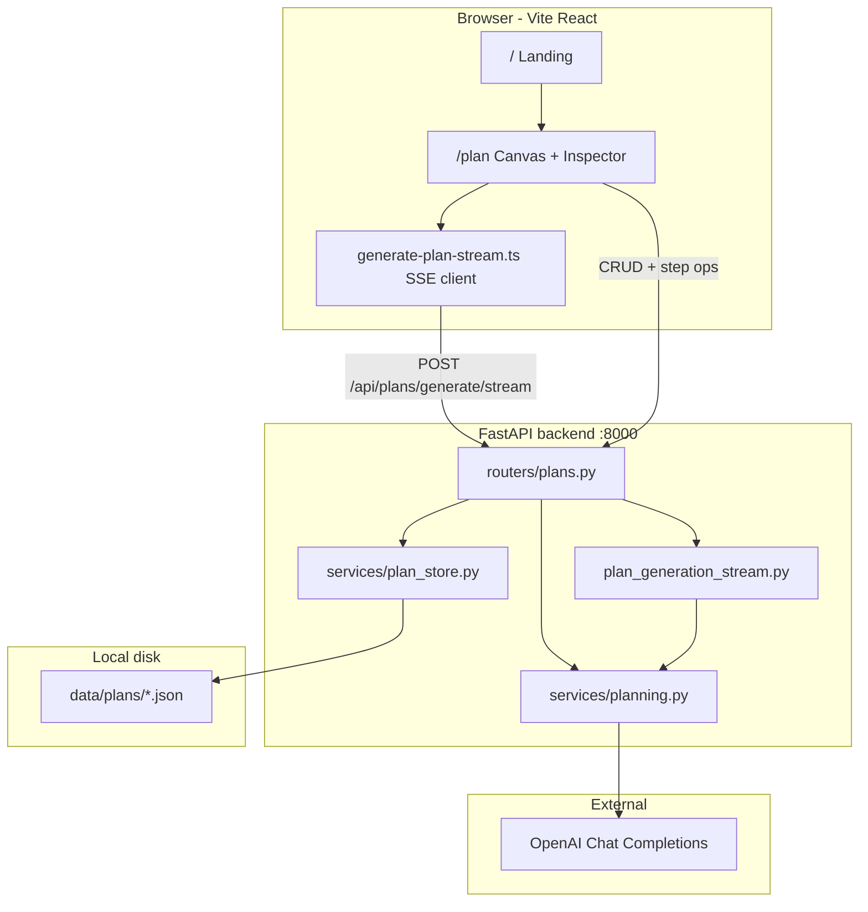
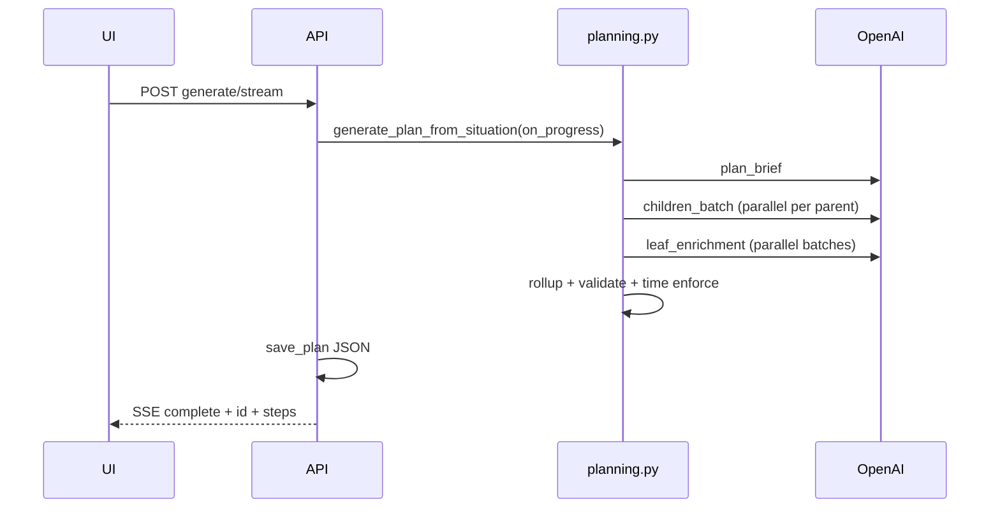

# Next Steps Agent — Project Description

This document describes how **Next Steps Agent** works end to end: purpose, architecture, data model, AI generation pipeline, API, UI, configuration, and operational behavior.

---

## 1. Purpose

Next Steps Agent turns a free-text **situation** (what you are trying to accomplish) into a **hierarchical plan tree**:

- **Branch nodes** are phases, milestones, or groupings (title + description, rolled-up time).
- **Leaf nodes** are **actionable tasks** with:
  - `implementationGuide` — numbered how-to steps
  - `acceptanceCriteria` — verifiable “done when” conditions
  - `estimatedMinutes` — per-task time estimate

Users refine plans on a **canvas mind map** (React Flow) with a **right-hand inspector** for situation text, planning properties, step editing, and context-driven updates.

Generation is powered by **OpenAI** structured outputs validated with **Pydantic v2**. Plans are persisted as **JSON files** on disk (no database).

---

## 2. High-level architecture



**Development:** UI on port **5173** proxies `/api` → **8000** (10-minute proxy timeout).  
**Production:** `npm run build` → `frontend/dist/` served by FastAPI; API and SPA on one port.

---

## 3. Technology stack

| Layer | Technology |
|-------|------------|
| API | Python 3.11+, FastAPI, Uvicorn |
| Validation / models | Pydantic v2 (`backend/app/models/plan.py`) |
| LLM | OpenAI Python SDK — `chat.completions.parse` with JSON schema, fallback to `json_object` |
| UI | Vite, React 18, TypeScript, Tailwind CSS v4 |
| Canvas | `@xyflow/react` (React Flow) |
| Routing | `react-router-dom` |
| Storage | JSON files under `data/plans/` (gitignored) |

---

## 4. Repository layout

```
NextStepsAgent/
├── backend/
│   ├── app/
│   │   ├── main.py              # FastAPI app, CORS, SPA mount
│   │   ├── config.py            # Env, limits, parallelism, paths
│   │   ├── models/plan.py       # PlanStep, PlanBrief, enrichment schemas
│   │   ├── routers/plans.py     # REST + SSE generate
│   │   ├── services/
│   │   │   ├── planning.py      # Core LLM pipeline
│   │   │   ├── plan_store.py    # JSON persistence
│   │   │   ├── rate_limit.py    # In-memory rate limit
│   │   │   └── export_plan.py   # Markdown export helpers
│   │   ├── plan_detail.py       # low / medium / high profiles
│   │   ├── plan_budget.py       # Time caps from properties
│   │   ├── plan_properties.py   # Property normalization
│   │   ├── plan_leaf_expand.py  # Heuristic: splittable leaves
│   │   ├── plan_generation_stream.py  # SSE worker thread
│   │   └── constants_properties.py    # Preset template metadata
│   └── tests/
├── frontend/
│   └── src/
│       ├── pages/LandingPage.tsx
│       ├── components/canvas/     # Workspace, inspector, progress
│       ├── components/plan-mindmap/
│       ├── lib/                   # Types, SSE, export, step utils
│       └── context/WorkspaceSessionContext.tsx
├── data/plans/                    # Saved plans (*.json)
├── context/                       # Project documentation (this folder)
│   ├── project_description.md     # This file
│   ├── AGENTS.md
│   ├── development.md
│   ├── initial_plan_description.md
│   └── custom_property.md
└── README.md                      # Quick start (links to context/)
```

---

## 5. Core data model

### 5.1 `PlanStep` (saved tree node)

| Field | Role |
|-------|------|
| `id` | Stable UUID string |
| `title`, `description` | Human-readable step |
| `priority` | `low` \| `medium` \| `high` \| `critical` |
| `estimatedMinutes` | Leaf: task time; branch: **sum of children** after rollup |
| `isActionable` | `true` = leaf task; `false` = branch |
| `implementationGuide`, `acceptanceCriteria` | **Leaves only** |
| `properties` | Optional per-step planning context (from + button) |
| `children` | Nested steps; `null` or absent on leaves |

**Leaf rule:** actionable steps must not have children and must have an implementation guide (enforced in `validate_plan_tree`).

### 5.2 `SavedPlan` (persisted file)

```json
{
  "id": "uuid",
  "situation": "user situation text",
  "createdAt": "ISO-8601 UTC",
  "detailLevel": "low|medium|high",
  "properties": [{ "name", "value", "templateId?" }],
  "steps": [ /* PlanStep tree */ ]
}
```

### 5.3 `PlanProperty` (planning context)

Name/value pairs (max 12 per scope) with optional `templateId` presets:

- `deadline` — plan-wide time budget (“Complete within 8 weeks”)
- `subtree_budget` — cap for work under a specific step
- `hours_per_week`, `success`, `constraints`, `current_state`, `focus`

Parsed durations in `plan_budget.py` (hours, days, weeks, minutes) drive LLM prompts and post-processing.

### 5.4 In-memory `SkeletonNode` (generation only)

While generating, the backend uses a mutable skeleton tree with `leaf_id` (UUID) per node so **enrichment** can attach guides before final `PlanStep` IDs are assigned.

---

## 6. Detail levels (`plan_detail.py`)

Three tiers control **tree depth**, **phase count**, and **minimum leaf targets** (guidance only — no hard maximum leaf cap).

| Level | Target depth | Depth range | Min leaves (default) | Max phases |
|-------|--------------|-------------|----------------------|------------|
| **low** | 2 | 2–3 | 15 | 3 |
| **medium** | 4 | 3–5 | 40 | 6 |
| **high** | 6 | 4–6 | 75 | 12 |

Env overrides: `MIN_LEAVES_LOW`, `MIN_LEAVES_MEDIUM`, `MIN_LEAVES_HIGH`.

The **PlanBrief** LLM call sets `maxDepth` and `suggestedTotalLeaves`; `clamp_brief_to_profile()` floors depth and leaf suggestions to profile minimums.

---

## 7. Plan generation pipeline

Entry points:

- `generate_plan_from_situation()` — synchronous result
- `iter_plan_generate_events()` — same logic on a background thread, SSE progress
- Frontend uses **`POST /api/plans/generate/stream`** exclusively for initial generate

### 7.1 Pipeline overview



### 7.2 Phase 1 — Context assembly

1. Strip situation; optional `locale` line.
2. `normalize_plan_properties()` on root properties.
3. `plan_budget_minutes_from_properties()` — plan-wide minute cap from deadline-like fields.
4. `format_properties_block()` — text block appended to every LLM user message.

### 7.3 Phase 2 — Plan brief (single LLM call)

Schema: `PlanBrief` — top-level **phases** with titles, descriptions, priorities, `allocatedMinutes`, `targetChildCount`, plus:

- `maxDepth` — how many levels before leaves
- `suggestedTotalLeaves` — target actionable task count

Progress: ~8% → 15% (`phase: brief`).

### 7.4 Phase 3 — Skeleton expansion (parallel)

Phases become root `SkeletonNode`s. **Breadth-first** expansion:

- For each non-actionable parent at the current depth, `_expand_children_for_parent()` calls OpenAI:
  - `children_batch` — intermediate branches
  - `children_batch_leaves` — when `force_leaves` (near max depth)
- **`ThreadPoolExecutor`** with `PARALLEL_EXPAND_WORKERS` (default **6**).
- Prompts include `leaf_budget_guidance()` — “at least ~N leaves” without a hard max.
- Parent `estimatedMinutes` on branches are placeholders; **rollup** recalculates from children later.

`leaf_target = max(profile.min_leaves_target, brief.suggested_total_leaves)`.

Progress: ~15% → 60% (`phase: expand`).

### 7.5 Phase 4 — Leaf enrichment (parallel batches)

Every skeleton leaf gets full detail in batches:

- Batch size: `LEAF_ENRICH_BATCH_SIZE` (default **20**)
- **`PARALLEL_ENRICH_WORKERS`** (default **4**) concurrent `leaf_enrichment` calls
- Per leaf output (`LeafEnrichmentItem`):
  - Refined `description`
  - `implementationGuide` (3–8 numbered steps)
  - `acceptanceCriteria`
  - `estimatedMinutes` (with time-cap rules in prompt)

`attach_enrichments_to_skeleton()` mutates skeleton nodes; then `skeleton_to_plan_steps()` assigns real step IDs.

Progress: ~60% → 92% (`phase: enrich`) — typically the longest phase.

### 7.6 Phase 5 — Finalize

1. `rollup_estimated_minutes()` — branch times = sum of children.
2. `validate_plan_tree()` — warnings logged, not fatal.
3. If plan-wide cap set: `enforce_time_budget_by_phase()` scales leaf minutes proportionally per top-level phase.

Progress: `finalize` → `done` (100%).

### 7.7 Structured LLM calls (`_call_structured`)

- Up to **3 attempts** per call.
- Prefer `client.chat.completions.parse` + Pydantic model.
- On failure, fall back to `json_object` + manual validate.
- Temperature lowered on retries; repair message appended to conversation.

Per-request timeout: `OPENAI_TIMEOUT_SEC` (default **300s**).

---

## 8. Time budgets (`plan_budget.py`)

| Scope | Source | Behavior |
|-------|--------|----------|
| **Plan-wide** | Root properties (`deadline`, “complete within”, etc.) | Prompt + `enforce_time_budget_by_phase()` after generate |
| **Branch / step** | Step + button properties (`subtree_budget`, etc.) | Prompts for `apply_step_context`, `expand_leaf_into_substeps`; clamp leaf minutes |

**Important:** Expansion/enrichment prompts do **not** use parent “time pools” that force children to sum to parent minutes. Parents roll up from children. Branch caps apply to **subtree** operations and single-step revision.

`MAX_EXECUTION_TASK_MINUTES` = **90** per leaf in prompts and PATCH validation.

---

## 9. Post-generation operations

### 9.1 Apply step context (`+` on branch or leaf)

**Endpoint:** `POST /api/plans/{id}/apply-step-context`  
**Alias (deprecated):** `POST .../regenerate-subtree`

**Behavior:** Revises **one step in place** via `StepContextRevision` LLM call.

- **Leaf:** updates title, description, guide, criteria, minutes; **children unchanged**.
- **Branch:** updates title/description only; guide/criteria cleared; **children unchanged**.

Merged context = ancestor step properties + root plan properties + new step properties.

### 9.2 Expand leaf into sub-steps

**Endpoint:** `POST /api/plans/{id}/steps/{stepId}/expand-substeps`

**When allowed:** `leaf_can_expand_into_substeps()` — e.g. ≥12 minutes, not atomic short titles (“Send …”, “Email …”).

**Behavior:** Replaces leaf with a **branch**; expands children (parallel skeleton) + enriches new leaves; preserves plan situation and detail level.

### 9.3 Manual step edit

**Endpoint:** `PATCH /api/plans/{id}/steps/{stepId}`  
**UI:** `StepEditorForm` in inspector when a step node is selected.

### 9.4 Suggest properties

**Endpoint:** `POST /api/plans/suggest-properties`  
LLM suggests 3–6 name/value pairs for root situation or a specific step.

---

## 10. HTTP API reference

Base path: `/api/plans`

| Method | Path | Description |
|--------|------|-------------|
| `GET` | `/` | List plan metadata (preview, createdAt) |
| `GET` | `/{id}` | Load full plan |
| `DELETE` | `/{id}` | Delete plan file |
| `PATCH` | `/{id}` | Update situation, properties, detailLevel |
| `PATCH` | `/{id}/steps/{stepId}` | Manual step field updates |
| `POST` | `/generate` | Sync generate + save (legacy; UI uses stream) |
| `POST` | `/generate/stream` | **SSE** generate + save |
| `POST` | `/suggest-properties` | LLM property suggestions |
| `POST` | `/{id}/apply-step-context` | Revise step from + context |
| `POST` | `/{id}/regenerate-subtree` | Same as apply-step-context |
| `POST` | `/{id}/steps/{stepId}/expand-substeps` | Split leaf into sub-steps |

**Generate body (camelCase):**

```json
{
  "situation": "string (10–8000 chars)",
  "locale": "optional",
  "properties": [{ "name", "value", "templateId" }],
  "detailLevel": "low|medium|high"
}
```

**SSE events** (`text/event-stream`):

| type | Payload |
|------|---------|
| `progress` | `{ phase, message, percent }` |
| `complete` | `{ id, steps, properties }` |
| `error` | `{ error }` |

Phases: `start`, `brief`, `expand`, `enrich`, `finalize`, `done`.

**Rate limit:** 12 generate-related requests per client key per 60s (`GENERATE_RATE_LIMIT_*`). Key from `X-Forwarded-For` / `X-Real-IP`.

---

## 11. Persistence (`plan_store.py`)

- Directory: `PLANS_DIR` (default `data/plans/`)
- File: `{uuid}.json`
- On save/load: `rollup_estimated_minutes()` applied
- List: scans `*.json`, sorts by `createdAt` desc, limit 50

No encryption or multi-user isolation — suitable for local/single-user use.

---

## 12. Frontend application

### 12.1 Routes

| Path | Page |
|------|------|
| `/` | `LandingPage` — intro + link to planner |
| `/plan` | `PlanRoute` → `PlanningWorkspace` inside `AppShell` |

### 12.2 Canvas workspace (`PlanningWorkspace.tsx`)

Central state: `CanvasDocument`

- `situation`, `situationSaved`, `detailLevel`
- `rootProperties`, `steps`, `planId`
- `selection` — what the inspector shows

**Mind map (`PlanMindMap.tsx`):**

- Root node = situation (after saved)
- Tree built by `mindmap-layout.ts` → React Flow nodes/edges
- **Expand/collapse** modes for branches
- **+ buttons** (separate `AddButtonNode` on the **left** of nodes):
  - Empty canvas / root: add situation
  - Branch: `add-before` → planning context for that step
  - Splittable leaf: `expand-leaf` → “Generate sub-steps” in inspector
- Click step body → `step` selection → edit form + read-only guide display

### 12.3 Inspector (`InspectorPanel.tsx`)

| Selection | Inspector content |
|-----------|-------------------|
| (none), not saved | Hint: click + to add situation |
| `situation` / `add-root` | Situation textarea, detail level, optional root properties, **Generate plan** |
| `add-before` | Step context properties, save context |
| `expand-leaf` | Generate sub-steps button |
| `step` | `StepEditorForm` + save |

During generate: `PlanGenerationProgress` bar (phase, %, message) via SSE.

**No client-side timeout** on generate — request runs until complete or network/proxy failure.

### 12.4 Client libraries

| Module | Role |
|--------|------|
| `generate-plan-stream.ts` | Parse SSE from stream endpoint |
| `canvas-document.ts` | Document state, `findStepById`, tree patches |
| `plan-properties.ts` | Property rows, payload building |
| `plan-step-utils.ts` | Leaf/branch helpers, expand eligibility |
| `export-plan.ts` | Download JSON / Markdown |
| `step-editor.ts` | Edit draft validation |

### 12.5 Session / history

`WorkspaceSessionContext` and plan list in shell — load/delete prior plans from API.

---

## 13. Configuration (environment)

Loaded from repo root `.env` / `.env.local`:

| Variable | Default | Purpose |
|----------|---------|---------|
| `OPENAI_API_KEY` | — | Required for generation |
| `OPENAI_MODEL` | `gpt-4o-mini` | Chat model |
| `OPENAI_ORGANIZATION` | — | Optional org header |
| `OPENAI_TIMEOUT_SEC` | `300` | Per LLM HTTP call |
| `PLANS_DIR` | `data/plans` | Storage path |
| `MIN_LEAVES_LOW/MEDIUM/HIGH` | 15 / 40 / 75 | Minimum leaf targets |
| `LEAF_ENRICH_BATCH_SIZE` | `20` | Leaves per enrichment call |
| `PARALLEL_EXPAND_WORKERS` | `6` | Parallel expand jobs |
| `PARALLEL_ENRICH_WORKERS` | `4` | Parallel enrichment batches |

**Vite dev proxy:** 600s timeout for `/api`.

---

## 14. Validation and limits

| Limit | Value |
|-------|-------|
| Situation length | 10–8000 characters |
| Max tree depth | 6 |
| Max children per node | 12 |
| Max total nodes (soft) | 150 (`MAX_TOTAL_NODES`) |
| Max plan properties | 12 |
| Max minutes per leaf (API PATCH) | 10080 (field max); practical cap 90 in prompts |

---

## 15. Export

Frontend can export current plan:

- **JSON** — raw tree + metadata
- **Markdown** — human-readable outline (uses backend export helpers where applicable)

---

## 16. Error handling

| Failure | Typical response |
|---------|------------------|
| Missing API key | 503, message mentions `OPENAI_API_KEY` |
| Rate limit | 429 |
| Invalid situation/properties | 400 JSON `{ error }` |
| OpenAI / parse failure | 502 |
| Step not found | 404 |
| Leaf not splittable | 400 on expand-substeps |

Validation warnings after generate are logged server-side; plan still returned.

---

## 17. Running the project

**Development (two terminals):**

```bash
# API
cd backend && pip install -r requirements.txt
python -m uvicorn app.main:app --reload --port 8000

# UI
cd frontend && npm install && npm run dev
```

Open http://localhost:5173 → `/plan`.

**Production:**

```bash
cd frontend && npm run build
cd backend && python -m uvicorn app.main:app --host 0.0.0.0 --port 8000
```

Serve UI + API on port 8000. Configure reverse-proxy timeouts **≥ 300s** (longer for high-detail plans).

---

## 18. Extension points

| Goal | Where to work |
|------|-------------|
| Change generation logic | `backend/app/services/planning.py` |
| Adjust detail tiers | `backend/app/plan_detail.py`, `config.py` |
| New API routes | `backend/app/routers/plans.py` |
| Schema / validation | `backend/app/models/plan.py` |
| Canvas UX | `frontend/src/components/canvas/`, `plan-mindmap/` |
| Property presets | `frontend/src/lib/plan-property-templates.ts`, `constants_properties.py` |

---

## 19. Related documentation

All docs live under `context/` — see [context/README.md](README.md) for an index.

- [development.md](development.md) — setup and deploy
- [AGENTS.md](AGENTS.md) — concise conventions for coding agents
- [initial_plan_description.md](initial_plan_description.md) — original product spec (may predate some behavior)
- [custom_property.md](custom_property.md) — planning properties behavior
- [../README.md](../README.md) — repo root quick start

---

## 20. Mental model summary

1. User describes a **situation** and optional **planning properties** (time, constraints, etc.).
2. Backend asks OpenAI for a **brief**, then **expands** a tree in parallel, then **enriches** all leaves in parallel batches.
3. Time rolls **up** from leaves; optional **caps** scale or clamp estimates.
4. User navigates the **mind map**, adds **context** via +, edits steps, or **splits** large leaves into sub-steps.
5. Everything is saved as **JSON** under `data/plans/` for later reload.

The system is designed for **iterative planning**: generate a solid first tree quickly, then refine locally and with targeted LLM calls per step rather than regenerating the entire plan every time.
